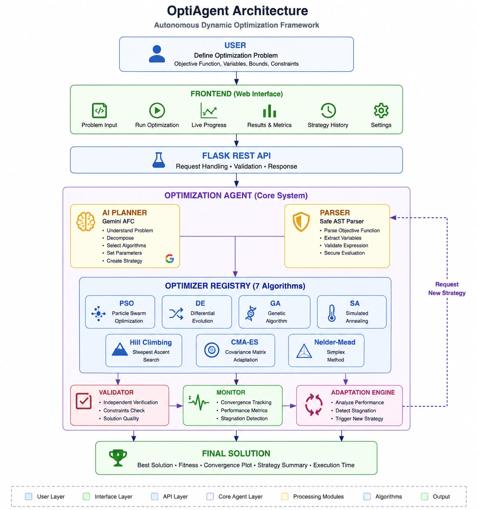

# OptiAgent

## Autonomous Agentic Optimization System

OptiAgent is an agentic optimization platform that automatically selects, executes, validates, monitors, and adapts numerical optimization strategies for user-defined mathematical objective functions.

Instead of requiring the user to manually choose an optimization algorithm, OptiAgent introduces an AI-driven decision layer that analyzes the optimization problem and selects an appropriate strategy.

### 🚀 Live Demo

**Frontend:** https://optiagent-frontend-272474227005.asia-south1.run.app

**Backend API:** https://optiagent-272474227005.asia-south1.run.app

---

## 🎯 What Is OptiAgent?

Traditional optimization systems usually follow this workflow:

```text
User
 ↓
Choose Algorithm
 ↓
Run Optimization
 ↓
Get Result

The problem is that choosing an appropriate optimization algorithm can depend on:

Objective-function characteristics

Search-space size

Dimensionality

Local minima

Exploration requirements

Convergence behavior


OptiAgent changes this workflow by introducing an autonomous decision-making layer:

User Problem
     ↓
Observe
     ↓
Reason
     ↓
Decide
     ↓
Optimize
     ↓
Validate
     ↓
Monitor
     ↓
Adapt
     ↓
Repeat

The goal is to make optimization strategy-aware and adaptive, rather than relying on a single fixed optimizer.


---

# 🖥️ Demo

OptiAgent provides a web interface for defining optimization problems, running the autonomous optimization agent, and viewing the resulting solution.

## 📸 Screenshots

### OptiAgent Interface


### Optimization


### Optimization Results


### Strategy and Convergence


## 🏗️ System Architecture



## 📊 Benchmark Results

OptiAgent was evaluated on several standard continuous optimization benchmark functions.

| Benchmark | Strategy | Best Score | Best Position | Stages |
|---|---|---:|---|---:|
| Sphere | CMA-ES | 0 | [0, 0] | 1 |
| Rosenbrock | PSO | 0 | [1, 1] | 2 |
| Rastrigin | CMA-ES | 0 | [0, 0] | 1 |
| Ackley | CMA-ES | 0 | [0, 0] | 1 |
| Schwefel | PSO | 2.5455 × 10⁻⁵ | [420.9687, 420.9687] | 2 |

### Observations

- CMA-ES successfully solved Sphere, Rastrigin, and Ackley in a single stage.
- PSO solved the Rosenbrock problem in two stages.
- PSO reached a near-optimal solution for the Schwefel function.
- Different optimization strategies were selected for different objective functions.
- Solutions were independently validated by OptiAgent before being accepted.

🧠 Agentic Optimization Workflow

USER PROBLEM
                         |
                         v
                Function Parser
                         |
                         v
                    AI Planner
                         |
                         v
                  Gemini AI + AFC
                         |
                         v
                Strategy Selection
                         |
                         v
                Optimizer Registry
                         |
                         v
                 Selected Optimizer
                         |
                         v
                Numerical Optimization
                         |
                         v
                Solution Validation
                         |
                         v
              Convergence Monitoring
                         |
                         v
                 Stagnation Detection
                         |
                    +----+----+
                    |         |
                Improving   Stagnating
                    |         |
                    v         v
                 Continue   Adaptation
                              |
                              v
                       New Strategy
                              |
                              v
                       Next Stage

The agent follows:

Observe
   ↓
Reason
   ↓
Decide
   ↓
Act
   ↓
Validate
   ↓
Monitor
   ↓
Adapt
   ↓
Repeat


---

✨ Key Features

Dynamic mathematical objective functions

Safe mathematical expression parsing

Dynamic optimization dimensions

User-defined variable bounds

Multiple numerical optimization algorithms

AI-based strategy selection

Gemini integration

Gemini Automatic Function Calling

Optimizer registry architecture

Independent solution validation

Convergence monitoring

Stagnation detection

Adaptive optimizer parameters

Multi-stage optimization

Global-best tracking

Strategy history

Convergence history

REST API

Web-based dashboard

Gemini failure fallback mechanism

Cloud deployment


---

🔬 Supported Optimization Algorithms

OptiAgent currently supports seven optimization strategies.

1. Particle Swarm Optimization

PSO is a population-based optimization method inspired by swarm intelligence.

It is useful for continuous optimization and global exploration.

2. Differential Evolution

Differential Evolution is an evolutionary population-based method that performs well on continuous optimization problems.

3. Genetic Algorithm

The Genetic Algorithm uses evolutionary mechanisms such as:

Selection

Crossover

Mutation


to search for good solutions.

4. Simulated Annealing

Simulated Annealing uses probabilistic exploration and can accept worse solutions temporarily to escape local minima.

5. Hill Climbing

Hill Climbing performs local search by repeatedly moving toward better neighboring solutions.

6. CMA-ES

Covariance Matrix Adaptation Evolution Strategy is designed for difficult continuous optimization problems and adapts the search distribution during optimization.

7. Nelder-Mead

Nelder-Mead is a derivative-free optimization algorithm based on a simplex.


---

🤖 AI Strategic Decision Making

The AI planner acts as the strategic layer of OptiAgent.

The planner can consider information such as:

Objective function

Number of dimensions

Variable bounds

Available algorithms

Current strategy

Optimization status

Current best score

Validation information

Convergence behavior

Stagnation


The planner then recommends an optimization strategy.

The selected strategy is passed to the optimizer registry.

Optimization Problem
        |
        v
    AI Planner
        |
        v
 Strategy Decision
        |
        v
 Optimizer Registry
        |
        v
 Numerical Optimizer


---

🔧 Gemini Automatic Function Calling

OptiAgent uses Gemini Automatic Function Calling (AFC) as part of its strategy-selection layer.

Conceptually:

Gemini
   |
   | Automatic Function Calling
   v
select_optimizer()
   |
   v
Optimizer Registry
   |
   v
Selected Algorithm

This allows the AI planning layer to interact with the optimization system through a structured tool interface rather than relying only on unstructured text responses.


---

🛡️ AI Failure Resilience

OptiAgent does not depend completely on the availability of the external AI service.

If Gemini becomes temporarily unavailable because of:

API quota limits

Rate limits

Service errors

Temporary connectivity problems


OptiAgent can switch to a local fallback strategy-selection mechanism.

Gemini AI
                 |
          API available?
            /       \
          YES       NO
           |         |
           v         v
      AI Strategy   Local
       Selection   Fallback
           |         |
           +----+----+
                |
                v
        Selected Optimizer

For example, when Gemini is unavailable, the local decision layer can select a suitable global optimizer based on characteristics of the objective function and previous optimization behavior.

This allows numerical optimization to continue instead of completely failing because of an external AI dependency.


---

🔄 Adaptive Optimization

OptiAgent does not necessarily use the same optimizer throughout the entire optimization process.

After each optimization stage, the system evaluates:

Stage performance

Global-best improvement

Convergence trend

Stagnation

Solution validity

Solution reliability


If progress is satisfactory, the current strategy can continue.

If stagnation is detected, the system performs adaptation.

Optimization Stage
        |
        v
Monitor Progress
        |
        v
Stagnation?
   /          \
 No            Yes
 |              |
 v              v
Continue    Adapt Parameters
                |
                v
         Select New Strategy
                |
                v
          Next Stage


---

🧩 Optimizer-Specific Adaptation

The Adaptation Engine can modify optimizer behavior when progress stalls.

Examples include:

PSO

Increase exploration through parameters such as inertia and social influence.

Differential Evolution

Refresh part of the population to increase population diversity.

Genetic Algorithm

Increase mutation rate to restore population diversity.

Simulated Annealing

Increase neighborhood exploration.

CMA-ES

Increase search step size.

Hill Climbing

Use additional restarts to escape local minima.

Nelder-Mead

Allow simplex restart behavior to explore a different region.


---

✅ Independent Solution Validation

Optimization results are independently validated before being accepted.

The validator checks:

Solution structure

Number of dimensions

Variable bounds

Objective score

Actual objective-function evaluation

Solution reliability


The reported optimizer score is not blindly trusted.

The objective function is independently evaluated at the returned solution.

Optimizer Result
       |
       v
Solution Validator
       |
       +----> Bounds Check
       |
       +----> Dimension Check
       |
       +----> Objective Re-evaluation
       |
       +----> Reliability Check
       |
       v
Validated Result


---

📈 Convergence Monitoring

OptiAgent records optimization progress throughout execution.

Convergence information can include:

Stage
Algorithm
Iteration
Score

The monitoring system analyzes the optimization history to identify whether the optimizer is:

Improving

Converging

Flat

Stagnating


This information is then used by the adaptation layer.


---

🧮 Mathematical Expression Support

OptiAgent accepts user-defined mathematical expressions.

Examples:

x1**2 + x2**2

(x1 - 3)**2 + (x2 + 2)**2

sin(x1)**2 + cos(x2)**2

sqrt(x1**2 + x2**2)

418.9829*2 - (x1*sin(sqrt(abs(x1))) + x2*sin(sqrt(abs(x2))))

Supported mathematical functions include:

sin()
cos()
tan()
exp()
sqrt()
log()
abs()

Supported constants include:

pi
e

Variables follow the format:

x1
x2
x3
...


---

🔐 Safe Expression Evaluation

OptiAgent does not directly execute arbitrary Python code supplied by the user.

The mathematical expression is parsed using Python's Abstract Syntax Tree (AST) system.

Only approved:

Variables

Constants

Operators

Mathematical functions


are permitted.

This provides a restricted mathematical execution environment instead of unrestricted Python eval() execution.


---

🏗️ System Architecture

+-----------------------+
|       Frontend        |
|      Web Dashboard    |
+-----------+-----------+
            |
            v
+-----------------------+
|       Flask API       |
|      REST Endpoint    |
+-----------+-----------+
            |
            v
+-----------------------+
|  Optimization Agent  |
+-----------+-----------+
            |
      +-----+-----+
      |           |
      v           v
 AI Planner    Optimizer
      |           |
      v           v
 Gemini AFC    Registry
                  |
        +---------+---------+
        |    |    |    |    |
        v    v    v    v    v
       PSO   DE   GA   SA   CMA-ES
        |
        +---- Hill Climbing
        |
        +---- Nelder-Mead
                  |
                  v
          Solution Validator
                  |
                  v
          Convergence Monitor
                  |
                  v
          Adaptation Engine


---

📁 Project Structure

OptiAgent/
│
├── backend/
│   ├── adaptation.py
│   ├── agent.py
│   ├── ai_planner.py
│   ├── api.py
│   ├── benchmark.py
│   ├── candidate_selector.py
│   ├── cma_es.py
│   ├── differential_evolution.py
│   ├── function_parser.py
│   ├── genetic_algorithm.py
│   ├── hill_climbing.py
│   ├── main.py
│   ├── monitor.py
│   ├── nelder_mead.py
│   ├── optimizer.py
│   ├── optimizer_registry.py
│   ├── random_search.py
│   ├── simulated_annealing.py
│   └── solution_validator.py
│
├── data/
├── frontend/
├── models/
├── tests/
│
├── .gitignore
├── LICENSE
├── README.md
└── requirements.txt


---

⚙️ Requirements

OptiAgent requires:

Python 3.10+

Flask

Flask-CORS

Google GenAI SDK

NumPy

SciPy

python-dotenv

Gunicorn


Install dependencies:

pip install -r requirements.txt


---

🔑 Environment Configuration

Create a .env file for local development:

GEMINI_API_KEY=your_api_key_here

The API key must remain on the backend.

Never place the Gemini API key in frontend JavaScript.

Never commit .env to GitHub.

The repository .gitignore should exclude:

.env
.venv/
__pycache__/
*.pyc


---

🚀 Running Locally

Start the Backend

From the project root:

.\.venv\Scripts\python.exe backend\api.py

The Flask API runs locally at:

http://127.0.0.1:5000


---

❤️ Health Check

Run:

Invoke-RestMethod http://127.0.0.1:5000/health

Expected:

status
------
ok


---

🌐 Start the Frontend

From the project root:

cd frontend
python -m http.server 5500

Open:

http://127.0.0.1:5500


---

🔌 REST API

Health Endpoint

GET /health

Example:

http://127.0.0.1:5000/health


---

Optimization Endpoint

POST /optimize

Example request:

{
  "objective": "x1**2 + x2**2",
  "dimensions": 2,
  "bounds": [
    [-10, 10],
    [-10, 10]
  ],
  "max_stages": 5,
  "patience": 3
}


---

📊 Optimization Result

A successful optimization returns information including:

Best position

Best score

Strategy history

Stage history

Convergence history

AI recommendation


Example:

{
  "best_position": [0.001, -0.002],
  "best_score": 0.000005,
  "strategy_history": [
    "Nelder-Mead"
  ]
}


---

🎯 Example Optimization Problem

Consider:

f(x1, x2) = x1**2 + x2**2

Dimensions:

2

Bounds:

x1 ∈ [-10, 10]
x2 ∈ [-10, 10]

The theoretical global optimum is:

x1 = 0
x2 = 0

with:

f(x1, x2) = 0

OptiAgent should therefore search for a solution close to:

[0, 0]


---

🔁 Multi-Stage Optimization

OptiAgent can execute multiple optimization stages.

For example:

Stage 1
   ↓
Differential Evolution
   ↓
Stagnation detected
   ↓
Stage 2
   ↓
PSO
   ↓
Improvement
   ↓
Stage 3
   ↓
PSO

The actual strategy sequence depends on the AI planner, optimization behavior, and fallback logic.


---

🌍 Potential Real-World Applications

The current architecture focuses on continuous numerical optimization.

The same agentic architecture can be extended to real-world optimization problems.

Smart Logistics

Optimize:

Delivery routes

Vehicle assignment

Travel distance

Delivery time

Fuel consumption


Resource Allocation

Optimize:

Workforce allocation

Machine allocation

Budget allocation

Computing resources


Scheduling

Optimize:

Job scheduling

Employee scheduling

Machine scheduling

Task allocation


Engineering Optimization

Optimize:

Design parameters

Manufacturing parameters

Energy consumption

System performance


Operations Research

Optimize:

Cost

Time

Resource utilization

Capacity allocation


---

🔒 Security Considerations

The objective-function parser uses restricted AST evaluation instead of unrestricted Python execution.

The Gemini API key is stored server-side through environment variables.

For production systems, additional security controls should be considered:

Authentication

Rate limiting

HTTPS

Request validation

Secure secret management

Logging

Monitoring


---

☁️ Deployment

OptiAgent is currently deployed using Render.

Frontend

The web dashboard is deployed as a Render Static Site.

Backend

The Flask REST API is deployed as a Render Web Service using Gunicorn.

Architecture:

Internet
    |
    v
Public Frontend
    |
    v
Flask REST API
    |
    +----------> Gemini API
    |
    v
Optimization Agent
    |
    +--> Optimizer Registry
    |
    +--> Numerical Optimizers
    |
    +--> Solution Validator
    |
    +--> Convergence Monitor
    |
    +--> Adaptation Engine

The Gemini API key remains server-side and is never exposed to the public frontend.


---

⚠️ Gemini API Availability

Gemini is an external dependency of the strategic planning layer.

Availability can depend on:

API quota

Rate limits

Model availability

Project configuration

Service availability


Possible external errors include:

429 RESOURCE_EXHAUSTED
503 UNAVAILABLE
504 DEADLINE_EXCEEDED

OptiAgent includes a local fallback mechanism so that temporary Gemini failures do not necessarily stop numerical optimization.


---

🧪 Testing

The project supports testing of components such as:

Mathematical expression parsing

Optimization algorithms

Solution validation

API behavior

Agent components


Run:

pytest


---

📌 Current Development Status

Completed

[x] Objective-function input

[x] Safe mathematical expression parser

[x] Dynamic dimensions

[x] Variable bounds

[x] Multiple optimization algorithms

[x] Optimizer abstraction

[x] Optimizer registry

[x] AI planner

[x] Gemini integration

[x] Gemini Automatic Function Calling

[x] Gemini fallback mechanism

[x] Solution validation

[x] Convergence monitoring

[x] Stagnation detection

[x] Adaptation engine

[x] Multi-stage optimization

[x] Flask REST API

[x] Frontend API connection

[x] Optimization dashboard

[x] GitHub repository

[x] Cloud deployment


Improvements

[ ] Expanded automated test coverage

[ ] Benchmark dataset

[ ] Performance benchmarking

[ ] Production authentication

[ ] API rate limiting

[ ] Advanced visualization

[ ] Real-world logistics optimization

[ ] Experiment database


---

🚧 Limitations

The current system primarily targets continuous numerical optimization.

Some real-world optimization problems require additional capabilities such as:

Discrete variables

Integer constraints

Equality constraints

Inequality constraints

Multiple objectives

Large-scale datasets

Real-time external data


These capabilities can be added in future versions.


---

🔮 Future Roadmap

Phase 1 — Core Optimization

Multiple optimization algorithms

AI strategy selection

Validation

Monitoring

Adaptation


Phase 2 — Visualization

Convergence graphs

Optimization landscape visualization

Strategy comparison

Performance dashboard


Phase 3 — Real-World Optimization

Vehicle routing

Delivery optimization

Scheduling

Resource allocation


Phase 4 — Production

Authentication

Database

Experiment history

API rate limiting

Production monitoring

Advanced observability


---

🧠 Development Philosophy

OptiAgent separates strategic reasoning from numerical computation.

AI Planner
    ↓
Strategic Decision

Optimizer
    ↓
Numerical Search

Validator
    ↓
Independent Verification

Monitor
    ↓
Progress Analysis

Adaptation Engine
    ↓
Strategy Adjustment

This separation makes the system easier to:

Test

Extend

Debug

Deploy

Maintain

Replace individual components


---

🏆 Why OptiAgent?

Most optimization software focuses on executing an optimization algorithm.

OptiAgent focuses on the decision process surrounding optimization.

Traditional Optimization

Problem
  ↓
Fixed Algorithm
  ↓
Result

OptiAgent

Problem
  ↓
AI Strategy Selection
  ↓
Numerical Optimization
  ↓
Independent Validation
  ↓
Convergence Monitoring
  ↓
Stagnation Detection
  ↓
Adaptation
  ↓
Potential Strategy Change
  ↓
Final Solution

The core idea is:

AI Reasoning
      +
Numerical Optimization
      +
Independent Validation
      +
Monitoring
      +
Adaptation
      =
OptiAgent


---

📜 License

OptiAgent is released under the license included in this repository.

See the LICENSE file for the complete license terms.


---

👨‍💻 Project Summary

OptiAgent — Autonomous Agentic Optimization System

An agentic optimization framework where AI selects optimization strategies, numerical algorithms solve mathematical problems, independent validation verifies results, and monitoring plus adaptation allow the system to respond when optimization stagnates.

The project combines:

Agentic AI
+
Numerical Optimization
+
Function Parsing
+
Validation
+
Monitoring
+
Adaptive Decision Making
+
Cloud Deployment

into a single optimization platform.
