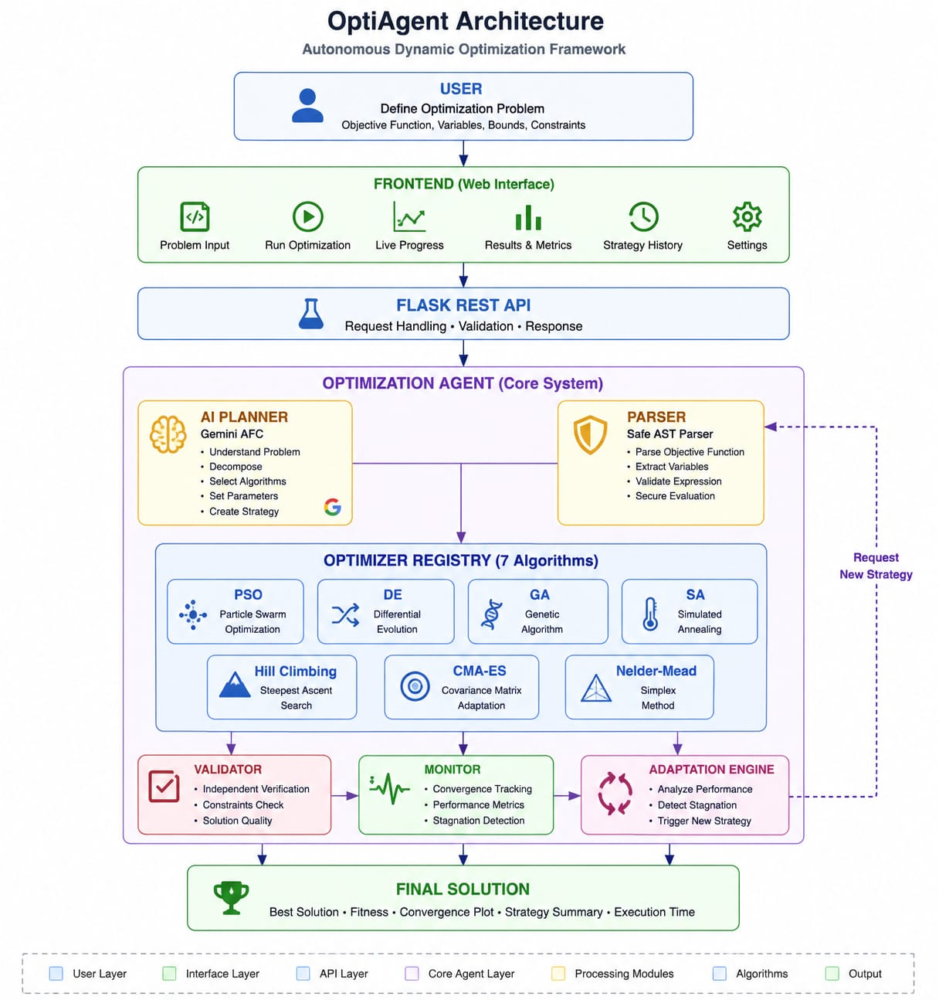

# OptiAgent 🧠⚡
 
## An Autonomous Agentic Optimization System
> **A project by a student exploring AI-driven numerical optimization**

Hey there! 👋 Welcome to **OptiAgent**. I built this project to tackle a problem I kept running into in numerical optimization: figuring out *which* algorithm to use for a given math function is tedious, and picking the wrong one often leads to getting stuck in local minima or wasting tons of iterations.

Instead of manually picking an optimizer and hoping for the best, OptiAgent introduces an autonomous AI agent layer (powered by Google Gemini with Automatic Function Calling + a local fallback engine) that analyzes the mathematical problem, selects the best optimization strategy, monitors convergence in real time, validates the solutions independently, and dynamically adapts the strategy whenever progress stalls.

---

## 🌐 Live Demo

I deployed the full project so you can test it live in your browser:

* **Frontend Dashboard:** [https://optiagent-frontend-272474227005.asia-south1.run.app](https://optiagent-frontend-272474227005.asia-south1.run.app)
* **Backend REST API:** [https://optiagent-272474227005.asia-south1.run.app](https://optiagent-272474227005.asia-south1.run.app)

*(Feel free to try out standard benchmark functions or type in your own custom equations!)*

---

## 💡 Why Did I Build OptiAgent? (The Core Idea)

In traditional optimization assignments and software, the workflow is almost always manual and rigid:

```text
User
  |
  v
Choose Algorithm (Guesswork / Manual Pick)
  |
  v
Run Optimization
  |
  v
Get Result (Or get stuck in a local minimum)
```

The issue is that selecting the right optimization algorithm isn't trivial. It heavily depends on:
* **Objective function landscape** (smooth, rugged, unimodal vs multimodal, noisy)
* **Search-space size & bounds**
* **Dimensionality** (2D vs high-dimensional spaces)
* **Presence of local minima** (valley traps like Rosenbrock or Schwefel)
* **Exploration vs exploitation requirements**
* **Convergence rate and behavior**

To solve this, I designed OptiAgent to follow a closed-loop **autonomous agentic cycle**:

```text
User Problem
     |
     v
   Observe   <-- Inspect the function, dimensions, bounds, and past history
     |
     v
    Reason   <-- AI analyzes landscape properties & previous stage performance
     |
     v
    Decide   <-- Select optimizer & tuned hyperparameters (via Gemini AFC or Local Fallback)
     |
     v
   Optimize  <-- Execute numerical optimization stage
     |
     v
   Validate  <-- Independently verify bounds, dimensions, and re-compute f(x)
     |
     v
   Monitor   <-- Check convergence rate, slope, and detect stagnation
     |
     v
    Adapt    <-- Tune parameters or switch algorithm if stuck
     |
     v
    Repeat   <-- Loop until global convergence or max stages reached
```

The main takeaway: **optimization should be strategy-aware and self-correcting rather than locked into a single fixed algorithm.**

---

## 📸 Screenshots & UI

I designed a responsive, clean dashboard to make it easy to input equations, configure bounds, and visualize how the agent works through multi-stage optimizations.

### 1. OptiAgent Main Interface
Setting up objective functions, variable bounds, dimensions, and hyperparameters:


### 2. Live Optimization in Action
Watching the agent dispatch stages and execute chosen strategies:


### 3. Optimization Results
Viewing the final global-best coordinates, objective score, and validation status:


### 4. Strategy History & Convergence Curves
Tracking which algorithms were picked at each stage and how the error decreased:


---

## 🏗️ System Architecture

Here is the high-level architecture diagram showing how the frontend, API, AI planner, optimizer registry, validator, and adaptation engine interact:



---

## 📊 Benchmark Experiments & Results

To see how well OptiAgent actually performs, I tested it against several classic continuous optimization benchmark functions (2-dimensional test cases). Here are the results I recorded:

| Benchmark Function | Strategy Selected | Best Score Found | Best Position Found $(x_1, x_2)$ | Stages Taken |
| :--- | :--- | :---: | :---: | :---: |
| **Sphere** | CMA-ES | `0.0` | `[0.0, 0.0]` | 1 |
| **Rosenbrock** | PSO | `0.0` | `[1.0, 1.0]` | 2 |
| **Rastrigin** | CMA-ES | `0.0` | `[0.0, 0.0]` | 1 |
| **Ackley** | CMA-ES | `0.0` | `[0.0, 0.0]` | 1 |
| **Schwefel** | PSO | `2.5455 × 10⁻⁵` | `[420.9687, 420.9687]` | 2 |

### 📝 What I Observed From These Runs:
* **CMA-ES** was selected for Sphere, Rastrigin, and Ackley and successfully found the exact global minimum in just a single stage. It handles rotational and multimodal landscapes remarkably well!
* **PSO** tackled the notorious banana-shaped Rosenbrock valley, successfully hitting the global minimum `[1.0, 1.0]` in 2 stages after detecting stagnation and adapting particle velocities.
* **Schwefel** has deceptive peaks and distant minima; PSO explored the search space and got within `2.5455 × 10⁻⁵` of the theoretical minimum `[420.9687, 420.9687]`.
* The AI planner dynamically picked *different* optimization strategies depending on the objective formula structure.
* Every single result was independently re-checked by the validation module before being accepted.

---

## 🔄 Detailed Agentic Optimization Workflow

Here is the step-by-step pipeline executed under the hood:

```text
USER PROBLEM (Math expression, dimensions, bounds)
     |
     v
Function Parser (Safe AST parser, extracts variables, ensures safety)
     |
     v
AI Planner (Constructs problem context, state, and history)
     |
     v
Gemini AI + AFC (Evaluates problem; invokes select_optimizer tool)
     |
     v
Strategy Selection (Selects algorithm + hyperparameter adjustments)
     |
     v
Optimizer Registry (Resolves strategy name to concrete optimizer class)
     |
     v
Selected Optimizer (Runs numerical search for N iterations)
     |
     v
Solution Validation (Double-checks bounds, dimensions, evaluates f(x))
     |
     v
Convergence Monitoring (Logs history, calculates improvement rate)
     |
     v
Stagnation Detection (Checks if loss change < threshold over patience window)
     |
     +-------------------+
     |                   |
     v                   v
  Improving          Stagnating
     |                   |
     v                   v
 Continue Stage      Adaptation Engine
                         |
                         v
                   New Strategy / Parameter Shift
                         |
                         v
                    Next Stage (Warm-started from best position)
```

The underlying agent loop is:
```text
Observe  ->  Reason  ->  Decide  ->  Act  ->  Validate  ->  Monitor  ->  Adapt  ->  Repeat
```

---

## ✨ Key Features I Implemented

* **Dynamic Math Expressions:** Accepts arbitrary user-typed mathematical formulas.
* **AST-Based Safe Parser:** Parses formulas into Python bytecode safely using AST—zero risk of malicious code execution!
* **Dynamic Dimensions:** Supports 1D, 2D, and higher-dimensional search spaces.
* **Custom Variable Bounds:** Set per-variable search boundaries `[min, max]`.
* **7 Diverse Optimization Algorithms:** Global metaheuristics, evolutionary strategies, and local search algorithms.
* **AI-Driven Strategy Selection:** Uses Google Gemini to analyze functions and recommend strategies.
* **Gemini Automatic Function Calling (AFC):** Structured tool calling rather than messy string parsing.
* **Resilient Local Fallback:** Gracefully falls back to a rule-based selector if Gemini is offline or rate-limited.
* **Extensible Optimizer Registry:** Clean factory pattern for registering and instantiating optimizers.
* **Independent Solution Validator:** Never blindly trusts the optimizer; re-evaluates candidate coordinates directly.
* **Real-Time Convergence Monitor:** Tracks iterations, stages, fitness scores, and trajectory history.
* **Stagnation Detection & Adaptation:** Detects when an optimizer gets stuck and triggers restarts or algorithm switches.
* **Multi-Stage Optimization Pipeline:** Passes global-best solutions across stages for warm-started refinement.
* **Global-Best Tracking:** Keeps a permanent record of the best valid point seen across all stages.
* **Full History Log:** Detailed logs of every stage, strategy change, and convergence curve.
* **Clean REST API:** Built with Flask and Flask-CORS for seamless integration.
* **Interactive Frontend:** Built with modern CSS and vanilla JS for fast, dependency-free visualization.
* **Cloud Ready:** Fully deployable on Google Cloud Run and Render.

---

## 🧮 Supported Optimization Algorithms

I implemented and integrated **seven** distinct optimization algorithms into the registry so the agent has a well-rounded toolkit to pick from:

### 1. Particle Swarm Optimization (PSO)
* **How it works:** Simulates a flock of particles moving through the parameter space, updating their positions based on personal bests and the swarm's global best.
* **Best used for:** Continuous spaces with complex multimodal landscapes needing broad global exploration.

### 2. Differential Evolution (DE)
* **How it works:** A stochastic population-based method that creates mutant vectors by taking vector differences between random population members, followed by crossover.
* **Best used for:** Difficult continuous optimization problems with non-linear, non-differentiable landscapes.

### 3. Genetic Algorithm (GA)
* **How it works:** Uses natural selection mechanics—tournament/roulette selection, uniform/arithmetic crossover, and mutation—to evolve a population toward optima.
* **Best used for:** Broad search spaces where diverse combinations of features need testing.

### 4. Simulated Annealing (SA)
* **How it works:** Inspired by the metallurgical annealing process. It explores neighboring states and accepts worse solutions with a probability that decreases as the temperature cools.
* **Best used for:** Escaping tricky local minima in rugged objective landscapes.

### 5. Hill Climbing
* **How it works:** An iterative local search algorithm that starts from a point and continually moves in the direction of steepest fitness improvement.
* **Best used for:** Quick local refinement, convex functions, or polishing a candidate solution found by a global optimizer.

### 6. CMA-ES (Covariance Matrix Adaptation Evolution Strategy)
* **How it works:** An advanced evolutionary algorithm that samples candidate solutions from a multivariate normal distribution and continuously updates the covariance matrix to capture the local topography.
* **Best used for:** Ill-conditioned, non-separable, and rugged continuous objective functions.

### 7. Nelder-Mead (Simplex Method)
* **How it works:** A popular derivative-free heuristic that maintains a geometric simplex of $n+1$ vertices in $n$ dimensions, transforming the simplex via reflection, expansion, contraction, and shrink operations.
* **Best used for:** Fast local convergence on continuous functions where gradient information is unavailable.

---

## 🧠 AI Strategic Decision Making

The strategic brains of the platform is the **AI Planner** (`backend/ai_planner.py`). Instead of a human guessing which algorithm to use, the planner inspects:

* The exact mathematical formula of the objective function
* Number of input dimensions ($x_1, x_2, \dots, x_n$)
* Variable bounds (e.g., $[-10, 10]$)
* Available algorithms currently active in the registry
* Currently executing strategy (if in stage $> 1$)
* Current best score and whether improvement occurred
* Independent validation status
* Convergence history and stagnation flags

```text
Optimization Problem Details
            |
            v
        AI Planner
            |
            v
    Strategy Decision (Algorithm + Hyperparameters)
            |
            v
     Optimizer Registry
            |
            v
    Numerical Optimizer Execution
```

The planner outputs a concrete strategy recommendation, which is then fetched from the registry and executed.

---

## 🤖 Gemini Automatic Function Calling (AFC)

To make AI decision-making robust and deterministic, I used **Gemini's Automatic Function Calling (AFC)** feature.

Instead of asking the LLM to write a paragraph in English and trying to scrape the algorithm name using regex, I provide Gemini with an explicit tool definition: `select_optimizer()`.

```text
Gemini LLM
   |
   | Automatic Function Calling
   v
select_optimizer(strategy="CMA-ES", reason="...", params={...})
   |
   v
Optimizer Registry
   |
   v
Instantiate & Execute Algorithm
```

This guarantees structured, typed arguments, eliminates hallucinated format errors, and makes the AI behave like an integrated component in the code.

---

## 🛡️ AI Failure Resilience (Offline Local Fallback)

One thing I quickly realized during testing: **external APIs fail, run out of credits, or hit rate limits.** I didn't want the whole optimization pipeline to crash just because the Gemini API was unreachable!

So, I built an automatic **Local Fallback Mechanism**:

```text
                 Gemini AI Planner
                         |
                         v
                  API Available?
                    /         \
                  YES         NO (Quota / Timeout / Network error)
                   |           |
                   v           v
             AI Strategy     Local Rule-Based
               Selection        Fallback
                   |           |
                   +-----+-----+
                         |
                         v
                 Selected Optimizer
```

If Gemini throws:
* `429 RESOURCE_EXHAUSTED` (Rate limit or quota hit)
* `503 UNAVAILABLE` (API temporary outage)
* `504 DEADLINE_EXCEEDED` (Network timeout)
* Or any missing API key issue

OptiAgent logs the warning and immediately transfers control to the local fallback engine. The fallback engine evaluates the objective function's known properties, search space size, and recent stage history to pick a solid global optimizer (such as PSO or DE) or local polisher. **The optimization run never dies because of an external API glitch.**

---

## 📈 Adaptive Multi-Stage Optimization

Why stick to one optimizer for the entire run? Often, an algorithm like PSO or DE is great for exploring the space early on, but once the agent is in the right neighborhood, an algorithm like Nelder-Mead or CMA-ES can zoom in on the exact minimum much faster.

After every stage, OptiAgent evaluates:
* Has the global best score improved?
* Is the convergence curve flat?
* Did the optimizer hit stagnation across the patience window?
* Is the returned solution valid according to our validator?

```text
Optimization Stage
        |
        v
  Monitor Progress
        |
        v
    Stagnation?
      /      \
    No        Yes
    |          |
    v          v
Continue    Adapt Parameters
               |
               v
        Select New Strategy (Switch Algorithm)
               |
               v
       Next Stage (Warm Started)
```

---

## ⚙️ Optimizer-Specific Adaptation Strategies

When stagnation is flagged, the **Adaptation Engine** (`backend/adaptation.py`) applies algorithm-specific interventions before restarting or handing off:

* **Particle Swarm Optimization (PSO):** Increases inertia and cognitive/social exploration coefficients to shake particles out of local clusters.
* **Differential Evolution (DE):** Re-seeds and mutates a fraction of the population to restore genetic diversity.
* **Genetic Algorithm (GA):** Bumps up the mutation rate to inject fresh genetic material.
* **Simulated Annealing (SA):** Reheats the temperature or widens neighborhood jump radius.
* **CMA-ES:** Expands search step size ($\sigma$) to look beyond the current local basin.
* **Hill Climbing:** Triggers random multi-start restarts to explore alternate peaks/valleys.
* **Nelder-Mead:** Reconstructs and re-initializes the simplex around the current best candidate.

---

## 🔍 Independent Solution Validation

In numerical programming, optimizers can sometimes return `NaN`, `Inf`, coordinates outside the allowed bounds, or incorrect self-reported scores. I made sure OptiAgent **never blindly trusts an optimizer's reported score**.

Every stage output passes through `backend/solution_validator.py`, which checks:
1. **Structural Integrity:** Ensures the solution is a valid 1D array/list of numbers.
2. **Dimension Check:** Confirms the coordinate count matches the requested dimensions ($N$).
3. **Bounds Check:** Verifies every coordinate falls strictly within $[lower\_bound, upper\_bound]$.
4. **Independent Evaluation:** Directly evaluates $f(x)$ on the returned coordinates using the AST parser to confirm the score matches the optimizer's claim.
5. **Reliability Verification:** Flags any numerical instability, overflow, or NaN values.

```text
Raw Optimizer Output
        |
        v
Solution Validator
        |
        +----> Bounds Check [min <= x <= max]
        |
        +----> Dimension Count Check
        |
        +----> Objective Function Re-evaluation: f_actual(x)
        |
        +----> Reliability & NaN Check
        |
        v
Validated Result (Accepted or Rejected)
```

---

## 📉 Convergence Monitoring

OptiAgent tracks the full iteration-by-iteration history across all stages:
* Current Stage index
* Active Algorithm name
* Iteration step
* Current Best Score

The monitor analyzes the moving average of improvements. If the difference between consecutive evaluations is below the tolerance threshold over a defined `patience` count, it raises a stagnation signal to trigger adaptation.

---

## 📐 Mathematical Expression Support & Syntax

OptiAgent allows users to enter standard mathematical expressions using familiar syntax.

### Examples:
* **Sphere:** `x1**2 + x2**2`
* **Shifted Paraboloid:** `(x1 - 3)**2 + (x2 + 2)**2`
* **Trigonometric / Wave:** `sin(x1)**2 + cos(x2)**2`
* **Euclidean Distance:** `sqrt(x1**2 + x2**2)`
* **Schwefel Benchmark:** `418.9829*2 - (x1*sin(sqrt(abs(x1))) + x2*sin(sqrt(abs(x2))))`

### Supported Functions:
* Trigonometry: `sin()`, `cos()`, `tan()`
* Exponential & Logarithmic: `exp()`, `log()`, `sqrt()`, `abs()`

### Supported Constants:
* `pi` ($\pi \approx 3.14159$)
* `e` ($e \approx 2.71828$)

### Variable Naming:
Variables are indexed starting from 1:
```text
x1, x2, x3, ... xn
```

---

## 🔒 Safe Expression Evaluation (AST Security)

One big risk with accepting user-input math formulas in Python is security—you should **never** use raw `eval()` or `exec()`.

To prevent code injection, I implemented `backend/function_parser.py` using Python's **Abstract Syntax Tree (`ast`)**:
* The expression is tokenized and parsed into an AST tree.
* Every single AST node is inspected against a strict whitelist of safe nodes (`ast.BinOp`, `ast.UnaryOp`, `ast.Call`, `ast.Name`, `ast.Constant`).
* Calls are only allowed to whitelisted math functions (`sin`, `cos`, `sqrt`, etc.).
* Access to `__builtins__`, `import`, system calls, file I/O, or custom attributes is strictly blocked.
* The safe AST is then compiled into a pure lambda function for high-speed numerical evaluation.

---

## 🗂️ Project Structure

Here is how the repository is organized:

```text
OptiAgent/
├── backend/
│   ├── adaptation.py             # Optimizer parameter adaptation & stagnation handling
│   ├── agent.py                  # Core agent loop: orchestrates planning, execution & monitoring
│   ├── ai_planner.py             # Gemini AFC planner & offline fallback logic
│   ├── api.py                    # Flask REST API endpoints (/health, /optimize)
│   ├── benchmark.py              # Standard benchmark test suite (Sphere, Ackley, etc.)
│   ├── candidate_selector.py     # Selects best solution candidates across stages
│   ├── cma_es.py                 # CMA-ES optimization implementation
│   ├── differential_evolution.py # Differential Evolution implementation
│   ├── function_parser.py        # Safe mathematical AST parser and validator
│   ├── genetic_algorithm.py      # Genetic Algorithm implementation
│   ├── hill_climbing.py          # Hill Climbing with random restarts
│   ├── main.py                   # CLI entry point for testing optimizations
│   ├── monitor.py                # Convergence logger and stagnation detector
│   ├── nelder_mead.py            # Nelder-Mead Simplex optimization
│   ├── optimizer.py              # Base abstract class for all optimizers
│   ├── optimizer_registry.py     # Registry / factory for optimizer instantiation
│   ├── random_search.py          # Baseline random search optimizer
│   ├── simulated_annealing.py    # Simulated Annealing implementation
│   └── solution_validator.py     # Independent bounds & re-evaluation validator
├── data/                         # Test data, exported results, and logs
├── frontend/                     # Web dashboard
│   ├── index.html                # Main UI layout
│   ├── style.css                 # Clean, responsive CSS styling
│   └── script.js                 # Frontend API calls and live rendering
├── models/                       # Data models and serializable schemas
├── screenshots/                  # Screenshots of UI and architecture diagrams
├── tests/                        # Automated unit tests (PyTest)
│   ├── test_function_parser.py   # Tests for AST expression validation & safety
│   └── test_optimizers.py        # Tests for optimizer algorithms & convergence
├── .gitignore                    # Git ignore file (virtualenvs, .env, pycache)
├── LICENSE                       # MIT License
├── README.md                     # You are here!
└── requirements.txt              # Python project dependencies
```

---

## 📦 Requirements & Dependencies

OptiAgent requires **Python 3.10+**. The full dependency list includes:
* `Flask` & `Flask-CORS` (REST API server)
* `google-genai` (Google Gemini SDK with Function Calling)
* `numpy` (Vector operations and numerical arrays)
* `scipy` (Matrix calculations and optimization utilities)
* `python-dotenv` (Loading environment variables)
* `gunicorn` (Production WSGI server for cloud deployment)
* `pytest` (Unit testing suite)

Install everything with pip:
```bash
pip install -r requirements.txt
```

---

## ⚙️ Environment Configuration

To run with full AI features, get a free Gemini API key from [Google AI Studio](https://aistudio.google.com/) and create a `.env` file in the project root:

```env
GEMINI_API_KEY=your_gemini_api_key_here
```

> **Security Note:**
> * Never commit your `.env` file to Git! It is already added to `.gitignore`.
> * The API key is strictly kept on the backend; the frontend never sees or handles secret keys.
> * If no API key is provided, OptiAgent automatically switches to its local fallback engine so you can still run full optimizations!

---

## 🚀 How to Run Locally

You can run OptiAgent completely on your local machine in just a couple of minutes:

### 1. Start the Flask Backend API

From the project root:

**On Windows (PowerShell):**
```powershell
.\.venv\Scripts\python.exe backend\api.py
```

**On macOS/Linux:**
```bash
python3 backend/api.py
```

The API will spin up at `http://127.0.0.1:5000`.

### 2. Verify Backend Health Check

In another terminal window:

**PowerShell:**
```powershell
Invoke-RestMethod http://127.0.0.1:5000/health
```

**cURL:**
```bash
curl http://127.0.0.1:5000/health
```

Expected output:
```json
{
  "status": "ok"
}
```

### 3. Start the Frontend Dashboard

From the project root:
```bash
cd frontend
python -m http.server 5500
```

Now open your browser and navigate to:
```text
http://127.0.0.1:5500
```
*(Or simply open `frontend/index.html` directly in your browser!)*

---

## 📡 REST API Reference

The Flask backend exposes clean endpoints for automated optimization workflows:

### 1. `GET /health`
Quick health check to confirm server status.

* **Response:**
```json
{
  "status": "ok"
}
```

---

### 2. `POST /optimize`
Submit an optimization task to the agent.

* **Headers:** `Content-Type: application/json`
* **Request Body:**
```json
{
  "objective": "x1**2 + x2**2",
  "dimensions": 2,
  "bounds": [
    [-10, 10],
    [-10, 10]
  ],
  "max_stages": 5,
  "patience": 3
}
```

* **Sample Success Response:**
```json
{
  "best_position": [0.000012, -0.000034],
  "best_score": 1.30e-9,
  "strategy_history": [
    "CMA-ES"
  ],
  "stage_history": [
    {
      "stage": 1,
      "strategy": "CMA-ES",
      "best_score": 1.30e-9,
      "converged": true
    }
  ],
  "convergence_history": [
    {"iteration": 1, "score": 45.2},
    {"iteration": 10, "score": 2.14},
    {"iteration": 25, "score": 0.0000013}
  ],
  "ai_recommendation": "CMA-ES was chosen due to quadratic landscape symmetry and smooth gradient decay."
}
```

---

## 🧪 Walkthrough: Example Optimization Problem

Let's walk through an intuitive example—the classic **Sphere function**:

$$f(x_1, x_2) = x_1^2 + x_2^2$$

* **Dimensions:** `2`
* **Bounds:**
  $$x_1 \in [-10, 10]$$
  $$x_2 \in [-10, 10]$$
* **Theoretical Optimum:**
  $$x_1 = 0,\quad x_2 = 0 \implies f(0, 0) = 0$$

### What OptiAgent does:
1. Parses `x1**2 + x2**2` into an AST structure and extracts variable symbols `x1` and `x2`.
2. Sends the problem formulation to the AI Planner.
3. Gemini identifies this as a convex, continuous bowl-shaped landscape and invokes `select_optimizer(strategy="CMA-ES")`.
4. CMA-ES runs, and within a single stage, converges to `[0.0, 0.0]` with fitness score `0.0`.
5. Solution Validator verifies coordinates are inside $[-10, 10]$ and re-evaluates $(0.0)^2 + (0.0)^2 = 0.0$.
6. Solution is accepted and returned to the UI dashboard!

---

## 🔁 Multi-Stage Optimization Example

What happens when an algorithm gets trapped? Here is an example of multi-stage adaptation on a difficult landscape:

```text
Stage 1:
   Strategy: Differential Evolution
   Status: Stagnation Detected (loss plateaued after iteration 40)
   Action: Trigger Adaptation Engine -> Switch to Particle Swarm Optimization

Stage 2:
   Strategy: PSO (initialized with the best coordinates from Stage 1)
   Status: Improvement Detected (found new descent path)
   Action: Continue optimization

Stage 3:
   Strategy: PSO (fine-tuning local neighborhood)
   Status: Global convergence achieved!
```

This flexibility allows OptiAgent to escape local minima that would permanently stall traditional single-algorithm runs.

---

## 🌍 Potential Real-World Applications

While I built this project focused on continuous mathematical functions, the exact same agentic architecture can be applied to real-world industrial and engineering domains:

### 1. Smart Logistics & Fleet Routing
* Minimizing total delivery distance, fuel consumption, and vehicle wait times under dynamic traffic conditions.

### 2. Resource Allocation & Cloud Compute
* Balancing CPU/memory workload distributions across server clusters to minimize energy costs and prevent throttling.

### 3. Automated Job Scheduling
* Assigning complex factory machines, personnel shifts, and hospital operating rooms to minimize downtime and bottlenecks.

### 4. Engineering & Structural Design
* Optimizing aerodynamic airfoil shapes, structural truss weights, or electronic component heat dissipation.

### 5. Financial Operations Research
* Optimizing investment portfolio weights for maximum Sharpe ratio subject to risk tolerance and sector constraints.

---

## 🔐 Security Considerations

Because this project accepts dynamic user input and interacts with cloud APIs, I implemented key security precautions:
* **No `eval()` Execution:** As mentioned earlier, mathematical expressions are evaluated exclusively through a sandboxed AST visitor.
* **Server-Side Secrets:** Gemini API keys are only accessed via `os.environ` on the backend server; frontend code contains zero secrets.
* **Input Boundary Validation:** Bounded limits on dimensions, stage count, and iterations prevent accidental Denial-of-Service (DoS) from excessive computation.
* **Future Enhancements:** For production grade deployments, adding user authentication (JWT/OAuth), IP rate limiting, and structured audit logs is recommended.

---

## ☁️ Cloud Deployment Details

I deployed OptiAgent using a decoupled architecture on Google Cloud Run / Render:

```text
Internet
   |
   v
Public Frontend (Static Web Hosting)
   |
   v  HTTPS REST API Calls
Flask REST API (Gunicorn WSGI Container)
   |
   +----------> Google Gemini API (Strategic Planner)
   |
   v
Optimization Agent
   ├── Optimizer Registry
   ├── Numerical Algorithms (PSO, DE, CMA-ES, GA, SA, HC, NM)
   ├── Solution Validator
   ├── Convergence Monitor
   └── Adaptation Engine
```

* **Frontend:** Hosted as a static web application for fast loading and zero server overhead.
* **Backend:** Packaged with Gunicorn to handle concurrent requests on containerized cloud infrastructure.
* **Security:** All API communication uses HTTPS, with secret keys managed through cloud environment variables.

---

## 🚦 Gemini API Availability & Graceful Degradation

Because Google Gemini is a cloud service, external factors can occasionally cause API errors:
* `429 RESOURCE_EXHAUSTED`: Rate limits or quota caps exceeded.
* `503 UNAVAILABLE`: Google service maintenance or intermittent connectivity.
* `504 DEADLINE_EXCEEDED`: Network timeout during peak traffic.

OptiAgent treats Gemini as an intelligent adviser rather than a single point of failure. The moment an API error occurs, OptiAgent automatically switches to the local heuristic fallback engine, logs the event for observability, and finishes the optimization without disruption.

---

## 🧪 Testing

To ensure code reliability, I wrote automated unit tests with `pytest` covering the function parser, AST security, each individual optimizer, and the validator.

Run all tests from the project root:
```bash
pytest
```

---

## 📋 Current Project Status

### What I've Finished:
- [x] Dynamic mathematical objective function input
- [x] Safe AST-based mathematical expression parser
- [x] Dynamic dimension support ($1D, 2D, \dots, nD$)
- [x] Variable lower/upper bounds enforcement
- [x] Seven numerical optimization algorithms implemented
- [x] Extensible optimizer abstraction & registry system
- [x] AI Planner using Google Gemini
- [x] Gemini Automatic Function Calling (AFC) integration
- [x] Offline fallback mechanism for rate limits & network failures
- [x] Independent solution validation engine
- [x] Real-time convergence monitoring
- [x] Stagnation detection algorithms
- [x] Adaptation engine with algorithm-specific tweaks
- [x] Multi-stage optimization workflow
- [x] Flask REST API backend
- [x] Interactive web dashboard frontend
- [x] Full Git repository setup & unit testing suite
- [x] Cloud deployment with live public URLs

### What I Want to Improve Next:
- [ ] Add more automated unit and integration tests
- [ ] Build a standardized benchmarking suite with automated CSV/JSON exports
- [ ] Add 3D interactive objective landscape visualization (using Three.js or Plotly)
- [ ] Add support for discrete and integer-constrained variables
- [ ] User authentication and saved experiment history
- [ ] Experiment with multi-objective optimization (Pareto frontiers)

---

## ⚠️ Limitations

Currently, OptiAgent has a few known limitations that I'm hoping to address in future versions:
* **Continuous Spaces:** The primary focus right now is on continuous numerical spaces; integer and combinatorial constraints are still experimental.
* **Explicit Constraints:** Currently supports box bounds $[min, max]$; non-linear inequality/equality constraints ($g(x) \le 0$) require penalty-function modeling.
* **Single Objective:** The core loop minimizes a single scalar objective score $f(x)$.

---

## 🗺️ Future Roadmap

* **Phase 1 — Core Optimization (Completed):** Multi-algorithm support, AI strategy selection, independent validation, monitoring, and adaptation.
* **Phase 2 — Advanced Visualization (In Progress):** Live 2D/3D contour plots, dynamic trajectory tracking, and side-by-side algorithm comparison charts.
* **Phase 3 — Real-World Problem Adapters:** Plug-and-play problem templates for Traveling Salesperson (TSP), vehicle routing, and portfolio allocation.
* **Phase 4 — Production Hardening:** User accounts, database-backed experiment tracking, API token authentication, and enterprise rate-limiting.

---

## 💭 Design Philosophy: Separation of Concerns

A big lesson I learned while building OptiAgent was to keep **strategic reasoning** completely separate from **numerical computation**:

```text
AI Planner           --> Strategic reasoning & algorithm choice
Optimizer            --> Numerical search execution
Validator            --> Independent result verification
Monitor              --> Progress tracking & convergence slope
Adaptation Engine    --> Dynamic course correction & parameter adjustment
```

Keeping these components decoupled makes the codebase easy to maintain, simple to unit test, and straightforward for anyone to drop in a new optimizer without touching the AI logic.

---

## 🏆 Summary: Traditional vs OptiAgent

| Aspect | Traditional Optimization | OptiAgent (My Project) |
| :--- | :--- | :--- |
| **Algorithm Selection** | Manual guesswork by user | Autonomous AI decision (Gemini AFC) |
| **Handling Stagnation** | Fails or stops early | Detects stagnation & dynamically adapts |
| **Result Verification** | Blindly trusts algorithm output | Independent validation & function re-check |
| **Optimization Stages** | Single algorithm throughout | Multi-stage with cross-algorithm handoffs |
| **API Resilience** | N/A (usually hardcoded) | Seamless fallback if AI is offline |
| **Expression Safety** | Risky `eval()` or hardcoded functions | Sandboxed AST parser |

---

## 📄 License

This project is licensed under the MIT License — see the [`LICENSE`](LICENSE) file for details.

---

## 🎓 Final Note

Thanks for checking out my project! If you have any suggestions, questions, or ideas for new optimizers to add, feel free to open an issue or submit a pull request! 🚀
